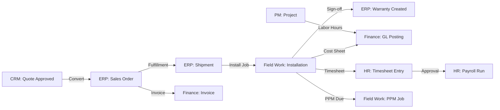

# Role-Based Access Control (RBAC) Specification

## EVERX Platform — 6 Independent Modules

**Version:** 2.0 | **Updated:** May 6, 2026 | **Modules:** CRM · ERP · Finance · PM · Field Work · HR · Settings

---

## 1. Module Architecture (As Built)

Based on the actual codebase (`App.tsx`, API layers, type definitions), EVERX consists of **7 independent modules** with separate routing, APIs, and type systems:

| Module | Route Prefix | API Layer | Type File | Page Directory |
|--------|-------------|-----------|-----------|----------------|
| **CRM** | `/crm/*` | `crmApi.ts` | `crm.ts` | `pages/accounts, contacts, leads, deals, quotes, activities` |
| **ERP** | `/erp/*` | `erpApi.ts` | `erp.ts` | `pages/equipment, spareparts, suppliers, purchaseorders, salesorders, shipments, warranties, servicetickets, acquisitions, siteassessments, equipmentqc, subcontractors, erp/inventory` |
| **Finance** | `/finance/*` | `financeApi.ts` | `finance.ts` | `pages/finance` |
| **PM** | `/pm/*` | `pmApi.ts` | `pm.ts` | `pages/employee` |
| **Field Work** | `/fieldwork/*` | `fieldworkApi.ts` | `fieldwork.ts` | `pages/fieldwork` |
| **HR** | `/hr/*` | `hrApi.ts` | `hr.ts` | `pages/hr` |
| **Settings** | `/admin/*` | `adminApi.ts, configApi.ts` | `auth.ts, config.ts` | `pages/admin` |

---

## 2. Role Definitions (17 Roles)

| # | Role ID | Display Name | Primary Module(s) |
|---|---------|-------------|-------------------|
| 1 | `SUPER_ADMIN` | Super Administrator | All — full unrestricted access |
| 2 | `ADMIN` | System Administrator | Settings, User/Role management, system config |
| 3 | `SALES_DIRECTOR` | Sales Director | CRM (full), ERP (sales orders, quotes) |
| 4 | `SALES_REP` | Sales Representative | CRM (assigned records), ERP (read equipment) |
| 5 | `FINANCE_DIRECTOR` | Finance Director / CFO | Finance (full), ERP (read), Field Work (cost reversals) |
| 6 | `ACCOUNTANT` | Accountant / Finance Clerk | Finance (AR/AP), ERP (POs, invoices) |
| 7 | `WAREHOUSE_MANAGER` | Warehouse & Logistics Mgr | ERP (inventory, POs, shipments, transfers) |
| 8 | `WAREHOUSE_STAFF` | Warehouse Associate | ERP (pick/pack/ship, goods receipt, barcode) |
| 9 | `SERVICE_DIRECTOR` | Service / Field Ops Director | Field Work (full), ERP (service tickets, subcontractors) |
| 10 | `FIELD_ENGINEER` | Field Service Engineer | Field Work (assigned jobs), PM (personal tasks) |
| 11 | `HR` | HR Administrator | HR (full module access) |
| 12 | `MANAGER` | Department Manager | HR (team view), PM (team tasks/timesheets) |
| 13 | `RECRUITER` | HR Recruiter | HR (recruitment, candidates, offer letters) |
| 14 | `PAYROLL` | Payroll Administrator | HR (payroll runs, payslips, profiles) |
| 15 | `EXECUTIVE` | Executive / C-Suite | Dashboards (all), HR analytics, finance reports |
| 16 | `EMPLOYEE` | Standard Employee | Employee self-service, PM (personal tasks/timesheets) |
| 17 | `COMPLIANCE_AUDITOR` | Compliance & Audit Officer | All modules (read-only), audit logs, security logs |

> [!NOTE]
> The codebase uses **role group constants** for route guarding:
> - `HR_ADMIN_ROLES` = `['SUPER_ADMIN', 'ADMIN', 'HR']`
> - `HR_MANAGER_ROLES` = `['MANAGER', ...HR_ADMIN_ROLES]`
> - `HR_RECRUITER_ROLES` = `['RECRUITER', ...HR_ADMIN_ROLES]`
> - `HR_PAYROLL_ROLES` = `['PAYROLL', ...HR_ADMIN_ROLES]`
> - `HR_SELF_SERVICE_ROLES` = `['EMPLOYEE', ...HR_MANAGER_ROLES]`
> - `WORKSPACE_MODULE_ROLES` = `['EMPLOYEE', 'ADMIN', 'SUPER_ADMIN']`

---

## 3. Permission Keys (Backend)

These are the granular permission strings stored in the `permissions` array on each user session:

| Permission Key | Module | Description |
|---------------|--------|-------------|
| `DASHBOARD_SELF_VIEW` | Dashboard | View personal CRM dashboard |
| `DASHBOARD_TEAM_VIEW` | Dashboard | View team-wide CRM dashboard |
| `DASHBOARD_FINANCE_VIEW` | Dashboard | View finance dashboard |
| `DASHBOARD_HR_VIEW` | Dashboard | View HR dashboard |
| `DASHBOARD_TECH_VIEW` | Dashboard | View technician dashboard |
| `DASHBOARD_OPERATIONS_VIEW` | Dashboard | View operations dashboard |
| `DASHBOARD_PM_VIEW` | Dashboard | View PM workspace dashboard |
| `CRM_VIEW` | CRM | View CRM pages |
| `CRM_CREATE` | CRM | Create CRM records |
| `ERP_VIEW` | ERP | View ERP pages |
| `FINANCE_VIEW` | Finance | View finance pages |
| `FIELDWORK_VIEW` | Field Work | View field work pages |
| `HR_VIEW` | HR | View HR pages / employee self-service |
| `PM_VIEW` | PM | View project management pages |
| `REPORT_VIEW` | Reports | View enterprise reporting |
| `USER_VIEW` | Settings | View user management |
| `ROLE_VIEW` | Settings | View role management / config studio |

---

## 4. Module Access Matrices

### 4.1 CRM Module

**Pages:** Accounts, Contacts, Leads, Deals (List + Kanban), Quotes, Activities

| Role | Accounts | Contacts | Leads | Deals/Kanban | Quotes | Activities | CRM Reports |
|:-----|:--------:|:--------:|:-----:|:------------:|:------:|:----------:|:-----------:|
| `SUPER_ADMIN` | CRUD | CRUD | CRUD | CRUD | CRUD | CRUD | CRUDE |
| `ADMIN` | R | R | R | R | R | R | R |
| `SALES_DIRECTOR` | CRUD | CRUD | CRUD | CRUD | CRUA | CRUD | CRUDE |
| `SALES_REP` | CRU* | CRU | CRU* | CRU* | CRU | CRU | RE |
| `FINANCE_DIRECTOR` | R | R | R | R | R | R | RE |
| `ACCOUNTANT` | R | R | — | R | R | — | R |
| `SERVICE_DIRECTOR` | R | R | R | R | R | R | R |
| `COMPLIANCE_AUDITOR` | R | R | R | R | R | R | RE |

`*` = restricted to assigned/office-scoped records only

### 4.2 ERP Module

**Pages:** Equipment, Spare Parts, Suppliers, Purchase Orders, Sales Orders, Shipments, Warranties, Service Tickets, Acquisitions, Site Assessments, Equipment QC, Subcontractors, Inventory (List/Ledger/Transfers)

| Role | Equipment | Spare Parts | Suppliers | POs | SOs | Shipments | Warranties | Service Tickets | Inventory | Subcontractors |
|:-----|:---------:|:-----------:|:---------:|:---:|:---:|:---------:|:----------:|:---------------:|:---------:|:--------------:|
| `SUPER_ADMIN` | CRUD | CRUD | CRUD | CRUD | CRUD | CRUD | CRUD | CRUD | CRUD | CRUD |
| `ADMIN` | R | R | R | R | R | R | R | R | R | R |
| `SALES_DIRECTOR` | RU | R | R | R | CRU | R | R | R | R | R |
| `SALES_REP` | R | R | — | — | CRU | R | R | — | R | — |
| `FINANCE_DIRECTOR` | R | R | R | R | R | R | R | R | R | R |
| `ACCOUNTANT` | R | R | R | CRU | CRU | R | R | R | R | R |
| `WAREHOUSE_MANAGER` | CRU | CRU | CRU | CRU | RU | CRU | RU | R | CRU | R |
| `WAREHOUSE_STAFF` | RU | RU | R | RU | RU | RU | R | R | RU | — |
| `SERVICE_DIRECTOR` | RU | CRU | R | CRU | R | R | CRU | CRUD | RU | CRUD |
| `FIELD_ENGINEER` | R | R | — | — | — | — | R | R | R | — |
| `COMPLIANCE_AUDITOR` | R | R | R | R | R | R | R | R | R | R |

### 4.3 Finance Module

**Pages:** Invoices (List/Detail/Form), Payments, Currency Rates, Financial Reports, Financial Close, Payment Reconciliation

| Role | Invoices | Payments | Currency Rates | Financial Reports | Period Close | Reconciliation |
|:-----|:--------:|:--------:|:--------------:|:-----------------:|:------------:|:--------------:|
| `SUPER_ADMIN` | CRUD | CRUD | CRUD | CRUDE | CRUA | CRUA |
| `ADMIN` | R | R | R | R | R | R |
| `FINANCE_DIRECTOR` | CRUA | CRUA | CRU | CRUDE | CRUA | CRUA |
| `ACCOUNTANT` | CRU | CRU | RU | RE | R | CRU |
| `SALES_DIRECTOR` | R | R | R | R | — | — |
| `SERVICE_DIRECTOR` | R | R | R | R | — | — |
| `COMPLIANCE_AUDITOR` | R | R | R | RE | R | R |

### 4.4 Project Management (PM) Module

**Pages:** `/pm/projects`, `/pm/projects/:id`, `/pm/tasks`, Employee Workspace (`/employee`), Employee Timesheets (`/employee/timesheets`), Employee Attendance (`/employee/attendance`)

| Role | Projects List | Project Detail | My Tasks | Workspace Dashboard | Employee Timesheets | Attendance |
|:-----|:------------:|:--------------:|:--------:|:-------------------:|:-------------------:|:----------:|
| `SUPER_ADMIN` | CRUD | CRUD | CRUD | Full | CRUD | CRUD |
| `ADMIN` | CRUD | CRUD | CRUD | Full | CRUD | CRUD |
| `EMPLOYEE` | R | R (assigned) | RU (assigned) | Personal | RU (personal) | RU (personal) |
| `MANAGER` | RU | CRU | CRU | Team | RU (team) | RU (team) |
| `FIELD_ENGINEER` | R | RU (assigned) | RU (assigned) | Personal | RU (personal) | RU (personal) |
| `SERVICE_DIRECTOR` | CRU | CRU | CRU | Team | RU | RU |
| `COMPLIANCE_AUDITOR` | R | R | R | — | R | R |

### 4.5 Field Work Module (Separate from HR)

**Pages:** `/fieldwork` (List), `/fieldwork/:id` (Detail/Create), `/dashboard/fieldwork`, `/dashboard/technician`

**Types:** `FieldJobType` (SITE_ASSESSMENT, DE_INSTALLATION, INSTALLATION, PPM, REPAIR), `FieldJobStatus` (DRAFT → SCHEDULED → ENGINEER_ASSIGNED → IN_PROGRESS → PENDING_SIGN_OFF → COMPLETED)

| Role | Field Job List | Field Job Detail | Create Job | Assign Engineer | Start/Complete | Sign-Off | Cost Sheet | Dispatch Dashboard | Technician Dashboard |
|:-----|:-------------:|:----------------:|:----------:|:---------------:|:--------------:|:--------:|:----------:|:------------------:|:--------------------:|
| `SUPER_ADMIN` | CRUD | CRUD | ✅ | ✅ | ✅ | ✅ | CRUD | ✅ | ✅ |
| `ADMIN` | R | R | — | — | — | — | R | R | — |
| `SERVICE_DIRECTOR` | CRUD | CRUD | ✅ | ✅ | ✅ | CRUA | CRU | ✅ | — |
| `FIELD_ENGINEER` | R (assigned) | RU (assigned) | — | — | ✅ (own) | CRU | R | — | ✅ |
| `FINANCE_DIRECTOR` | R | RU | — | — | — | R (reversals) | RU | R | — |
| `ACCOUNTANT` | R | RU | — | — | — | R | RU | — | — |
| `WAREHOUSE_MANAGER` | R | RU | — | — | — | R | R | RU | — |
| `COMPLIANCE_AUDITOR` | R | R | — | — | — | R | R | R | — |

**Security Roles (Backend `@PreAuthorize`):**
- `ROLE_FIELD_WORK_VIEW` — View jobs, reports
- `ROLE_FIELD_WORK_EDIT` — Create, update jobs
- `ROLE_FIELD_WORK_ENGINEER` — Complete checklists, start/complete jobs
- `ROLE_FIELD_WORK_MANAGER` — Assign engineers, manage costs
- `ROLE_FIELD_WORK_FINANCE` — Post costs, close periods, approve reversals

### 4.6 HR Module (Separate from Field Work)

**57 pages** under `/hr/*` — the largest module by page count.

#### 4.6.1 HR Admin Pages (require `HR_ADMIN_ROLES`)

| Page | Path | HR | ADMIN | SUPER_ADMIN |
|------|------|:--:|:-----:|:-----------:|
| HR Landing | `/hr` | CRUD | CRUD | CRUD |
| People Overview | `/hr/people` | CRUD | CRUD | CRUD |
| Employee List | `/hr/employees` | CRUD | CRUD | CRUD |
| Employee Detail | `/hr/employees/:id` | CRUD | CRUD | CRUD |
| Employee Form | `/hr/employees/new`, `/:id/edit` | CRUD | CRUD | CRUD |
| Department List | `/hr/departments` | CRUD | CRUD | CRUD |
| Department Form | `/hr/departments/new`, `/:id/edit` | CRUD | CRUD | CRUD |
| Position List | `/hr/positions` | CRUD | CRUD | CRUD |
| Position Form | `/hr/positions/new`, `/:id/edit` | CRUD | CRUD | CRUD |
| Leave Overview | `/hr/leave` | CRUD | CRUD | CRUD |
| Leave Policies | `/hr/leave-policies` | CRUD | CRUD | CRUD |
| Leave Balances | `/hr/leave-balances` | CRUD | CRUD | CRUD |
| Holiday List | `/hr/holidays` | CRUD | CRUD | CRUD |
| Time & Attendance Hub | `/hr/time` | CRUD | CRUD | CRUD |
| Onboarding Hub | `/hr/onboard` | CRUD | CRUD | CRUD |
| Onboarding Tasks | `/hr/onboarding-tasks` | CRUD | CRUD | CRUD |
| Performance | `/hr/performance` | CRUD | CRUD | CRUD |
| Compliance | `/hr/compliance` | CRUD | CRUD | CRUD |
| Candidates Pipeline | `/hr/candidates` | CRUD | CRUD | CRUD |
| Interview Scorecards | `/hr/candidates/:id/scorecard` | CRUD | CRUD | CRUD |
| Training List | `/hr/trainings` | CRUD | CRUD | CRUD |
| Training Form | `/hr/trainings/new`, `/:id/edit` | CRUD | CRUD | CRUD |
| Documents | `/hr/documents` | CRUD | CRUD | CRUD |
| Document Upload | `/hr/documents/upload` | CRUD | CRUD | CRUD |
| Exit & F&F | `/hr/exit-fnf` | CRUD | CRUD | CRUD |

#### 4.6.2 Recruitment Pages (require `HR_RECRUITER_ROLES`)

| Page | Path | RECRUITER | HR | ADMIN | SUPER_ADMIN |
|------|------|:---------:|:--:|:-----:|:-----------:|
| Recruitment Hub | `/hr/recruit` | CRUD | CRUD | CRUD | CRUD |
| Offer Letter List | `/hr/offer-letters` | CRUD | CRUD | CRUD | CRUD |
| Offer Letter Form | `/hr/offer-letters/new`, `/:id/edit` | CRUD | CRUD | CRUD | CRUD |

#### 4.6.3 Payroll Pages (require `HR_PAYROLL_ROLES`)

| Page | Path | PAYROLL | HR | ADMIN | SUPER_ADMIN |
|------|------|:-------:|:--:|:-----:|:-----------:|
| Payroll Hub | `/hr/payroll` | CRUD | CRUD | CRUD | CRUD |
| Payroll Wizard | `/hr/payroll/wizard` | CRUD | CRUD | CRUD | CRUD |
| Payroll Runs | `/hr/payroll-runs` | CRUD | CRUD | CRUD | CRUD |
| Payroll Run Form | `/hr/payroll-runs/new` | CRU | CRU | CRU | CRU |
| Payroll Run Detail | `/hr/payroll-runs/:id` | R | R | R | R |
| Payroll Profiles | `/hr/payroll-profiles` | CRUD | CRUD | CRUD | CRUD |
| Payslip List (Admin) | `/hr/payslips` | CRUD | CRUD | CRUD | CRUD |
| Payslip Create | `/hr/payslips/new` | CRU | CRU | CRU | CRU |

#### 4.6.4 Employee Self-Service Pages (require `HR_SELF_SERVICE_ROLES`)

| Page | Path | EMPLOYEE | MANAGER | HR+ |
|------|------|:--------:|:-------:|:---:|
| Leave Requests | `/hr/leave-requests` | CRU (own) | CRU + Approve | CRUD |
| Leave Request Form | `/hr/leave-requests/new` | CRU | CRU | CRUD |
| Timesheets (Admin) | `/hr/timesheets` | Redirect → `/employee/timesheets` | CRUD | CRUD |
| Timesheet Form | `/hr/timesheets/new` | Redirect | CRU | CRU |
| Reimbursements | `/hr/reimbursements` | CRU (own) | CRU + Approve | CRUD |
| Reimbursement Form | `/hr/reimbursements/new` | CRU | CRU | CRU |
| My Payslips | `/hr/my-payslips` | R (own) | R (own) | R |
| My Appraisal | `/hr/my-appraisal` | RU (own) | RU (own) | CRUD |
| Attendance | `/hr/attendance` | Redirect → `/employee/attendance` | CRUD | CRUD |
| HR Tasks Kanban | `/hr/tasks` | Redirect → `/employee/tasks` | CRUD | CRUD |
| My Assets | `/hr/my-assets` | R (own) | R (own) | CRUD |
| Benefits Enrollment | `/hr/benefits` | CRU (own) | CRU (own) | CRUD |
| Org Chart | `/hr/org-chart` | R | R | CRUD |

#### 4.6.5 Executive HR Pages (require `HR_EXECUTIVE_ROLES`)

| Page | Path | EXECUTIVE | HR | ADMIN | SUPER_ADMIN |
|------|------|:---------:|:--:|:-----:|:-----------:|
| HR Analytics | `/hr/analytics` | RE | RE | RE | CRUDE |

### 4.7 Settings Module

**Pages:** Config Studio, User Management, Role Management, Audit Logs, Tenant Workspaces, Backup & Restore, Module Licensing

| Role | Config Studio | User Mgmt | Role Mgmt | Audit Logs | Workspaces | Backup | Module Licensing |
|:-----|:------------:|:---------:|:---------:|:----------:|:----------:|:------:|:----------------:|
| `SUPER_ADMIN` | CRUD | CRUD | CRUD | CRUD | CRUD | CRUD | CRUD |
| `ADMIN` | CRUD | CRUD | CRUD | CRUD | CRUD | CRUD | CRUD |
| `COMPLIANCE_AUDITOR` | — | — | — | R | — | — | — |
| All Others | — | — | — | — | — | — | — |

---

## 5. Dashboard Routing Logic

The system uses intelligent dashboard routing based on permissions and roles:

```
/dashboard (landing)
  ├── MANAGER (non-admin) ────────→ /dashboard/manager (HRManagerDashboard)
  ├── EMPLOYEE (non-admin) ───────→ /employee (EmployeeWorkspaceDashboard)
  ├── DASHBOARD_OPERATIONS_VIEW ──→ /dashboard/operations
  ├── DASHBOARD_FINANCE_VIEW ─────→ /dashboard/finance
  ├── DASHBOARD_HR_VIEW ──────────→ /dashboard/hr
  ├── DASHBOARD_TECH_VIEW ────────→ /dashboard/technician
  ├── DASHBOARD_TEAM_VIEW ────────→ /dashboard/crm/team
  ├── DASHBOARD_SELF_VIEW ────────→ /dashboard/crm/user
  ├── DASHBOARD_PM_VIEW ──────────→ /dashboard/pm
  ├── FIELDWORK_VIEW ─────────────→ /dashboard/fieldwork
  └── HR_VIEW ────────────────────→ /employee
```

---

## 6. Cross-Module Data Flow



---

## 7. Multi-Entity & Office Isolation

Users are bound to an office location (`officeLocation` field on User model):
- **EverX AU** — AUD, GST
- **EverX US** — USD, Sales Tax
- **EverX JP** — JPY, Consumption Tax

**Global-scope roles** (bypass office filter): `SUPER_ADMIN`, `ADMIN`, `FINANCE_DIRECTOR`, `SERVICE_DIRECTOR`, `EXECUTIVE`

**Office-scoped roles** (see only local data): `SALES_REP`, `FIELD_ENGINEER`, `WAREHOUSE_STAFF`, `EMPLOYEE`

---

## 8. Frontend Route Guard Implementation

```tsx
// From App.tsx — actual implementation
const ProtectedRoute: React.FC<ProtectedRouteProps> = ({
  children,
  requiredPermissions,  // e.g. ['CRM_VIEW']
  requiredRoles,        // e.g. ['SUPER_ADMIN', 'ADMIN', 'HR']
}) => {
  // 1. Check authentication
  // 2. Infer permissions from pathname if none specified
  // 3. Check user.permissions includes at least one required permission
  // 4. Check user.roles includes at least one required role
  // 5. Redirect to first authorized path on failure
}
```

---

## 9. Consolidated Summary Matrix

| Role | CRM | ERP | Finance | PM | Field Work | HR | Settings |
|:-----|:---:|:---:|:-------:|:--:|:----------:|:--:|:--------:|
| `SUPER_ADMIN` | Full | Full | Full | Full | Full | Full | Full |
| `ADMIN` | View | View | View | Full | View | Full | Full |
| `SALES_DIRECTOR` | Full | Sales | View | View | View | — | — |
| `SALES_REP` | Assigned | SO only | — | — | — | — | — |
| `FINANCE_DIRECTOR` | View | View | Full | View | Costs | — | — |
| `ACCOUNTANT` | View | PO/SO | AR/AP | — | Costs | — | — |
| `WAREHOUSE_MANAGER` | — | Full | — | View | View | — | — |
| `WAREHOUSE_STAFF` | — | Stock | — | — | View | — | — |
| `SERVICE_DIRECTOR` | View | Service | View | Service | Full | — | — |
| `FIELD_ENGINEER` | — | View | — | Assigned | Assigned | — | — |
| `HR` | — | — | — | — | — | Full | — |
| `MANAGER` | — | — | — | Team | — | Team | — |
| `RECRUITER` | — | — | — | — | — | Recruiting | — |
| `PAYROLL` | — | — | — | — | — | Payroll | — |
| `EXECUTIVE` | View | View | View | View | View | Analytics | — |
| `EMPLOYEE` | — | — | — | Personal | — | Self-Service | — |
| `COMPLIANCE_AUDITOR` | View | View | View | View | View | View | Audit Logs |
